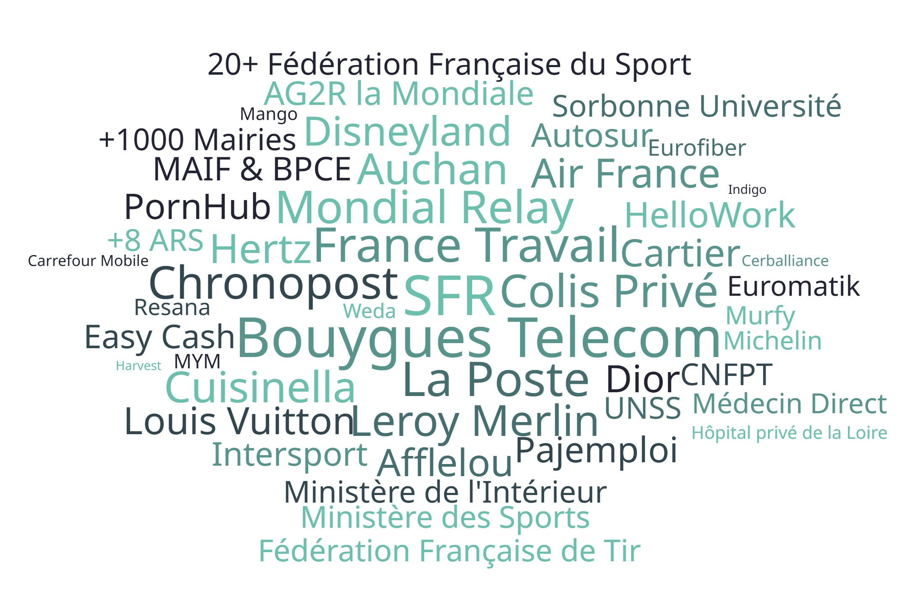

[%auto-animate]
== RGPD

[NOTE.speaker]
--
Réglement Général sur la protection des données

Promulgué en 2016 et mis en application en 2018, ça commence a dater et on commence à en oublier certains détails.
--

[%auto-animate]
=== Les grands principes

[.step]
* Consentement explicite
* Transparence
* Droit d'accès
* Droit de rectification
* Droit à l'effacement
* Droit d'opposition
* Notification en cas de fuite

[NOTE.speaker]
--
* Consentement : utilisation des cookies, de ses données, …
* Transparence : informer sur le traitement de ses données
* Droit d'accès : fournir les données sur demande (dans un format exploitable)
* Droit de rectification : permettre la correction de ses données
* Droit à l'effacement : permettre la suppression de ses données
* Droit d'opposition : arrêter le traitement de ses données
* Notification : informer les personnes concernées

Mais il y en a un qui devrait être considéré en premier : l'article 25
--

[%auto-animate]
=== Article 25 - § 1

[quote]
le responsable du traitement met en œuvre, tant **au moment de la détermination des moyens** ... qu'au moment du traitement lui-même, des mesures techniques et organisationnelles appropriées ... destinées ... à la protection des données

[.smaller]
_https://www.cnil.fr/fr/reglement-europeen-protection-donnees/chapitre4#Article25_

[%auto-animate]
=== Privacy by Design

[%step]
* Obligation de proactivité et intégration précoce
* La protection des données doit être prise en compte dès le début du projet, et non ajoutée a posteriori

[NOTE.speaker]
--
Protection des données dès la conception

Exemples :

- Minimisation des données (ne collecter que ce qui est strictement nécessaire).
- Anonymisation des données.
- Sécurité renforcée (chiffrement, accès restreint).
--

[%auto-animate]
=== Article 25 - § 2

[quote]
Le responsable du traitement ... garantit que ... **par défaut**, seules les données à caractère personnel qui sont nécessaires ... sont traitées. ... ces mesures garantissent que, **par défaut**, les données ... ne sont pas rendues accessibles à un nombre indéterminé de personnes ...

[.smaller]
_https://www.cnil.fr/fr/reglement-europeen-protection-donnees/chapitre4#Article25_

[%auto-animate]
=== Privacy by Default

[%step]
Les paramètres doivent être configurés pour limiter par défaut le traitement des données personnelles

[NOTE.speaker]
--
Protection des données par défaut

Exemples :

- Désactivation par défaut des fonctionnalités de partage de données.
- Limitation de la durée de conservation des données.
- Accès restreint aux données sensibles.
--

////
[%auto-animate]
=== Privacy by Design
 
* Émergence dans les années 90
* 1999 : **Ann Cavoukian** en formalise les principes fondamentaux
* 2005 : Adaptation basée sur les 7 lois de l'identité de **Kim Cameron**

[.smaller]
_https://en.wikipedia.org/wiki/Privacy_by_design_

[%auto-animate]
=== Privacy by Design

[.step]
1. Proactif, pas réactif ; préventif, pas correctif
2. Protection de la vie privée par défaut
3. Intégration dans la conception
4. Fonctionnalité intégrale (somme positive, pas somme nulle)
5. Sécurité de bout en bout
6. Visibilité et transparence
7. Respect de la vie privée des utilisateurs

[.smaller]
_https://en.wikipedia.org/wiki/Privacy_by_design_

[NOTE.speaker]
--
1. Anticiper et prévenir les atteintes à la vie privée avant qu'elles ne surviennent, plutôt que de les corriger après coup.
2. La protection de la vie privée doit être intégrée automatiquement dans les systèmes, sans que l'utilisateur n'ait à agir pour la garantir.
3. La protection de la vie privée est un élément essentiel de la conception des systèmes, pas une option ajoutée a posteriori.
4. La protection de la vie privée ne doit pas nuire à la fonctionnalité ou à l'utilisabilité du système : il est possible de concilier les deux.
5. Assurer la protection des données tout au long de leur cycle de vie, de la collecte à la destruction.
6. Les pratiques de gestion des données doivent être claires et transparentes pour les utilisateurs.
7. Placer l'utilisateur au centre de la conception, en lui offrant contrôle et choix sur ses données.
--
////

////
[%auto-animate]
=== Et aujourd'hui ?

Le Parlement européen et le Conseil de l'UE négocient plusieurs textes législatifs, notamment le règlement **ePrivacy**.

[.smaller]
--
_https://www.europarl.europa.eu/_

_https://trustarc.com/resource/european-union-data-privacy-whats-next-for-2025/_
--

[NOTE.speaker]
--
C'est lent, bloqué depuis 2017 mais repris en 2021 en phase de débat renouvelé.

Objectifs :

- Consentement centralisé (via système de liste blanche).
- Harmonisation avec les autres cadres internationaux.
- Précision du Privacy by Design (notamment dans les contextes IoT et IA).
- Exception pour les entrainements de modèles d'IA ?
--
////

////
[%auto-animate]
=== 😱

[.smaller]
_https://x.com/+_SaxX_+/status/2005540149384413200?s=20_

[NOTE.speaker]
--
- 90% de la population.
- Qui reconnait au moins une structure dans laquelle il a un compte ?
- La question n'est plus "si mes données ont fuitées ou quand mes données ont fuitées mais quand mes données seront exploitées"
- 12/01/2026 : fuite DINUM (160 000 documents)
--
////

////
[%auto-animate]
=== Les sanctions

En 2025 au niveau européen : 1 par jour en moyenne

[.smaller]
--
- 01/09/2025 : Google **325 M€**
- 03/09/2025 : Shein **150 M€**
- 27/11/2025 : American Express Carte France **1,5 M€**
- 11/12/2025 : MOBIUS SOLUTION LTD (sous-traitant de Deezer) **1 M€**
- 18/12/2025 : 5 candidats aux élections européennes et législatives de 2024 **23 500 €**
- 23/01/2025 : Société de transport routier de marchandises
--

[.smaller]
--
_https://www.cnil.fr/fr/thematique/cnil/sanctions_

_https://www.enforcementtracker.com/_
--

[NOTE.speaker]
--
Trop peu de sanctions et pas sur les causes des fuites

- Google : publicité dans Gmail sans consentement
- Shein : cookies sans consentement
- American Express Carte France cookies et prospection commerciale
- MOBIUS SOLUTION LTD pas notifié une violation à la CNIL ni informé les personne concernés
- 5 candidats aux élections européennes et législatives de 2024 (entre autres : mail de prospection à plusieurs 100aines de destinataires sans utiliser “cci”)
- Société de transport routier de marchandises (données de géolocalisation), pour violation de : minimisation des données, durée de conservation, obligation de réaliser une analyse d'impact
--
////

////
[%auto-animate]
=== Pourquoi ce non repect ?

[quote]
On n'a pas le temps pour ça maintenant, il faut avancer sur les fonctionnalités, on le fera plus tard.

[NOTE.speaker]
--
La protection des données est une fonctionnalité.

Article 25 paragraphe 2.1.4.1 : doit être mise en œuvre "au moment de la détermination des moyens du traitement"

Le coût n'est pas un motif pour ne pas mettre en œuvre.
--
////

[%auto-animate]
=== Anonymisation ≠ Pseudonymisation

[.step]
- Pseudonymisation = protection des données ⚠️ toujours soumis au RGPD
- Anonymisation = destruction des données

[NOTE.speaker]
--
- Pseudonymisation (chiffrement / hachage / ...) : possibilité de retrouver la donnée (déchiffrement, …) toujours soumis au RGPD : on stocke toujours des données personnelles
--

[%auto-animate]
=== Singularisation

Identifier un individu de façon indirecte

[%step.smaller]
[%header,cols="1,2,3,3,1"]
|===
| Âge | Mail | Commune | Poste | Salaire
| [30-40] | xxxxxx@xxx.fr | Amboise | DevOps | 48 000
| [40-50] | xxxxxx@xxx.com | Tours | Data Scientist | 52 000
| [30-40] | xxxxxx@xxx.com | Montlouis-sur-Loire | Développeur Fullstack | 42 000
| [30-40] | xxxxxx@xxx.fr | Amboise | Architecte Cloud | 65 000
| ... | ... | ... | ... | ...
|===

[%auto-animate]
=== Recoupement

[.step]
1. données anonymisées
2. sources externes non anonymisées
3. Ré-identification d'individus

[NOTE.speaker]
--
réseau sociaux, registres publics - listes électorales - cadastre, données commerciales, ...

Une société de transport partage des données anonymisées sur les trajets de ses usagers.

En croisant ces données avec les horaires de travail des entreprises (info linkedin ou sites des entreprises), et les adresses des écoles (trajet des parents), on peut identifier des individus spécifiques.
--

[%auto-animate]
=== Inférence

Déduire une information sensible non mentionnée

[%step.smaller]
[%header,cols="1,1,1,1"]
|===
| De | A | Horodatage | Durée
| 06xxxxxxxx32 | 07xxxxxxxx98 | 05/02/2026 à 22h12 | 1h 30
| 07xxxxxxxx98 | 06xxxxxxxx32 | 06/02/2026 à 22h02 | 1h 10
| 06xxxxxxxx32 | 07xxxxxxxx98 | 09/02/2026 à 21h55 | 2h 12
| 06xxxxxxxx32 | 07xxxxxxxx98 | 10/02/2026 à 22h10 | 1h 30
| ... | ... | ... | ...
|===

[%auto-animate]
=== Les bonnes pratiques

[.step]
- Minimiser au maximum la surface d'attaque
- Pas de duplication des données
- Données manipulées par un minimum d'acteur

[NOTE.speaker]
--
Risque 0 n'existe pas mais à minimiser en réduisant au maximum la surface d'attaque et faire en sorte que la donnée ne soit qu'à un seul endroit et manipulée par un minimum d'acteur.

C'est pas si simple mais il existe des solutions
--
