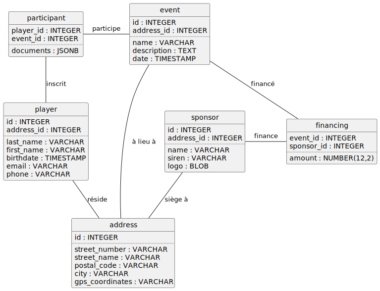

[%auto-animate]
== PostgreSQL Anonymizer

[%notitle.auto-animate]
=== PostgreSQL Anonymizer

image::images/PostgreSQL-Anonymizer.png[width=60%]

📘 https://postgresql-anonymizer.readthedocs.io/

icon:gitlab[] https://gitlab.com/dalibo/postgresql_anonymizer

[NOTE.speaker]
--
Extension PostgreSQL d'anonymisation et de masquage de données.

Damien Clochard : Ingénieur DBA Postgresql chez Dalibo et membre de l'association PostgreSQL.

- 2018 : initialisation de PostgreSQL Anonymizer
- 2022 : 1.0.0 production ready
- 2025 : 2.0.0 (réécriture en Rust)
--

[%auto-animate]
=== Principes

[.step]
1. Approche déclarative
2. Anonymisation by design 

[NOTE.speaker]
--
Approche déclarative via le DDL PostgreSQL : les règles d'anonymisation sont définies avec la définition des tables.
--

[%auto-animate]
=== Fonctionnalités

[.step]
* Détection des données sensibles
* Anonymisation statique
* Anonymisation dynamique
* Dump anonymisé
* Fonctions d'anonymisation (Données aléatoires, Données mélangées, Fausses données, Généralisation, Brouillage partiel, ...)

[NOTE.speaker]
--
Données générées localisées
--

[%auto-animate]
=== Installation

[%step]
[source,bash]
----
apt install postgresql_anonymizer_17
----

[%step]
[source,sql]
----
ALTER DATABASE foo SET session_preload_libraries = 'anon';
CREATE EXTENSION anon;
SELECT anon.init();
----

[.smaller]
https://postgresql-anonymizer.readthedocs.io/en/stable/INSTALL/

[NOTE.speaker]
--
1. ajout paquet avec repo gitlab dalibo (example pour debian/ubuntu mais doc pour ansible, docker, ...)
2. activation comme n'importe quelle extension
3. Création de l'extension
--

[%auto-animate]
=== Démo 1 : installation

💻

[%auto-animate]
=== Modèle de données

[%auto-animate]
=== Déclaration de la politique d'anonymisation

[%step]
--
**SECURITY LABEL** __[__ **FOR** __provider__ __]__

**ON** __PostgreSQL object__

**IS** { __string_literal__ | **NULL** };
--

[%step]
[source,sql]
----
SECURITY LABEL FOR anon ON ROLE dev IS 'MASKED';

SECURITY LABEL FOR anon ON COLUMN player.last_name
  IS 'MASKED WITH FUNCTION anon.dummy_last_name()';
----

[.smaller]
https://postgresql-anonymizer.readthedocs.io/en/stable/dynamic_masking/

[NOTE.speaker]
--
se base sur une fonctionnalité de PostgreSQL : les SECURITY LABEL qui permettent une délégation des accès à un système tiers - selinux
--

[%auto-animate]
=== Quelles données anonymiser ?

[%step]
[source,sql]
----
SELECT anon.detect();
----

[.smaller]
https://postgresql-anonymizer.readthedocs.io/en/stable/detection/

[NOTE.speaker]
--
Se base sur un référentiel.

Ne se substitue pas à une analyse exhaustive!
--

[%auto-animate]
=== Démo 2 : première règle

💻
