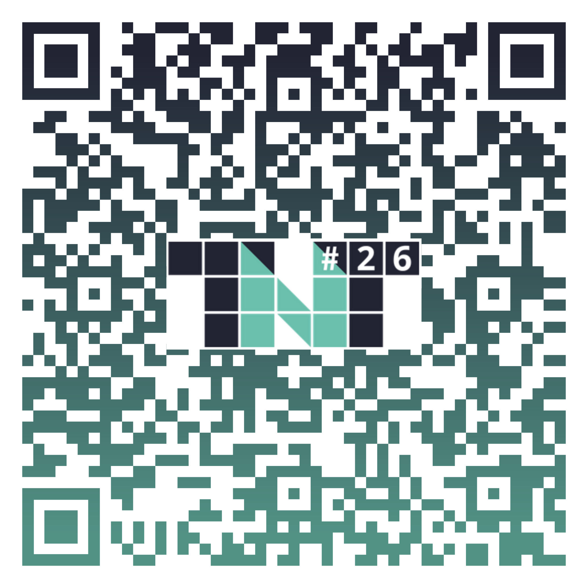

[%auto-animate]
== Synthèse

[%auto-animate]
=== Synthèse

[.step]
* Privacy by design
* Privacy by default
* Identifier les cas d'usage
* Utiliser PostgreSQL-Anonymizer

[NOTE.speaker]
--
* parcque c'est obligatoire
* pour établir la bonne politique et la bonne stratégie
* parcque c'est simple et qu'il y a tous les outils
--

[%notitle]
=== QR Code

Merci !

[.smaller]
https://nicolasguilhem.github.io/PostgreSQL-Anonymizer-Conference/home.html
